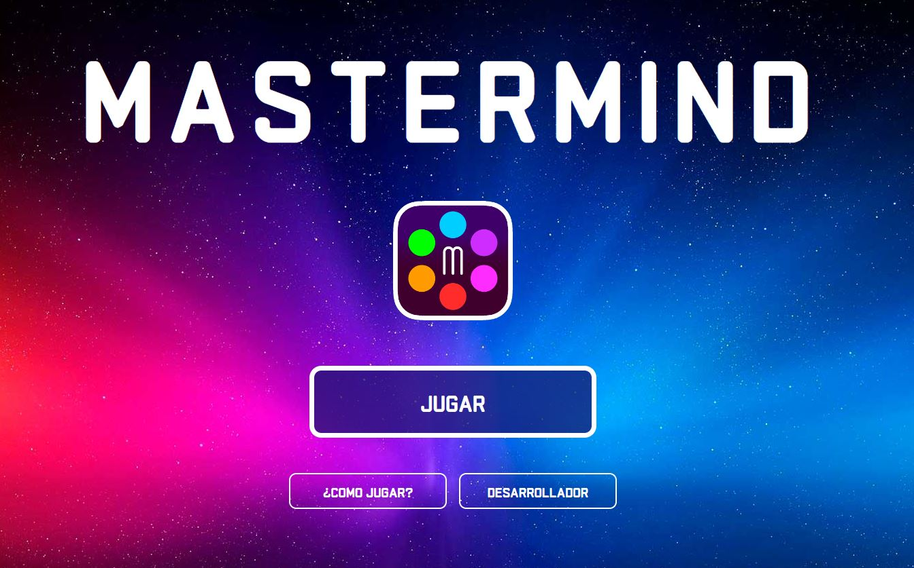
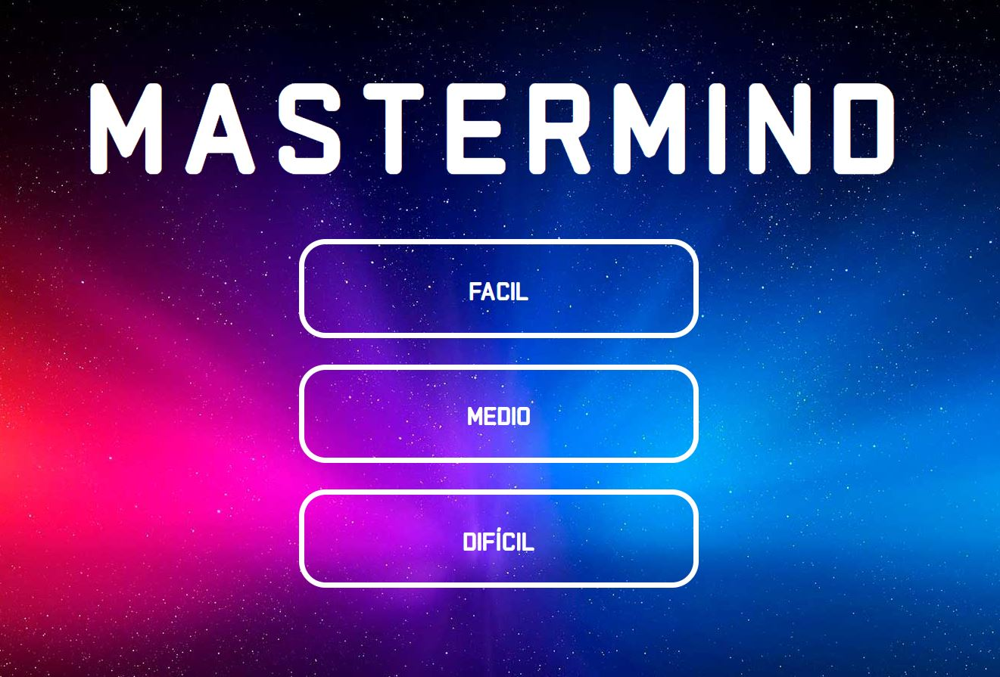
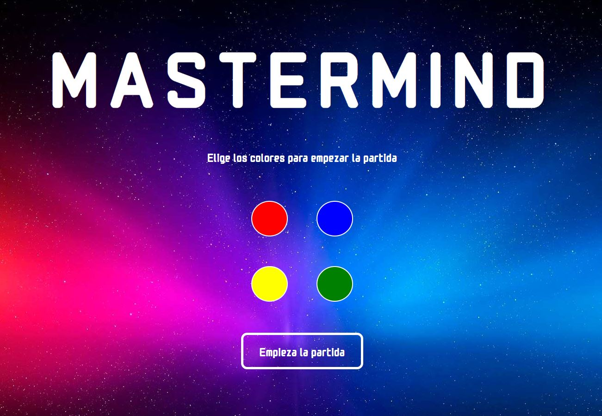
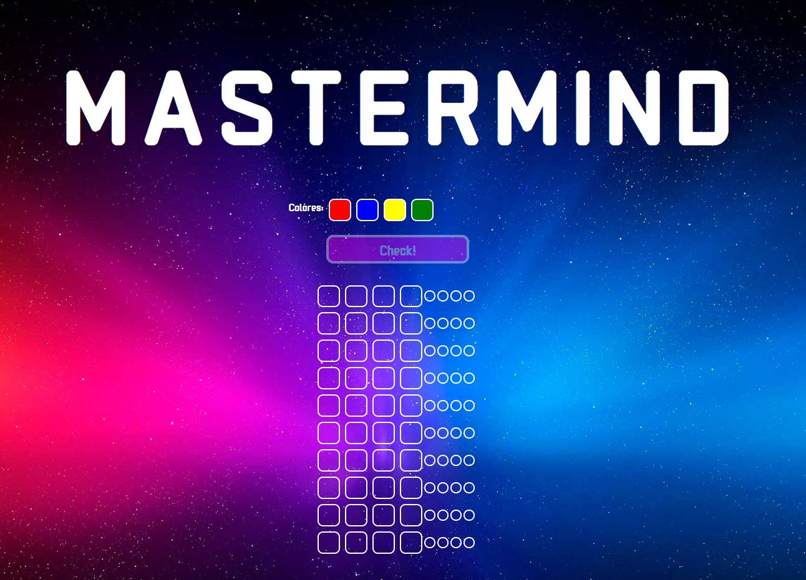

# Juego Mastermind

**Proyecto 3** - Juego Mastermind realizado con HTML5, CSS3 y Javascript.

Esta página web ha sido desarrollada por Hétor Mateu, como tercer proyecto del Bootcamp de Full Stack Developer de Geekshubs Academy.

El reto consiste en la creación del videojuego Mastermind. El juego debe contar con un mínimo de páginas enlazadas entre ellas, así como de una interfaz con un diseño responsive.

Puedes ver el resultado desde la siguiente dirección: https://hmateu.github.io/MasterMindProject/

## Tabla de contenidos
* [💻 Tecnologías utilizadas](#tecnologías-utilizadas)
* [:pick: Desarrollo](#desarrollo)
* [📃 Licencia y Copyright](#licencia-y-copyright)

### Tecnologías utilizadas
  
 

También se ha utilizado, para la creación de cada una de las imágenes que aparecen en el proyecto, el porgrama de edición: **Adobe Photoshop**.

### Desarrollo

Para la realización de este proyecto he utlizado HTML5, CSS3 y Javascript. Siendo este último clave para el buen desarrollo del mismo. Gracias al cual, he conseguido desarrollar un juego plenamente funcional.

La página web cuenta con múltiples páginas enlazadas entre ellas, siendo estas la página principal, la de introducción del nombre y elección de niveles, elección de colores, el propio juego, sobre mí, cómo jugar, la enhorabuena al ganador y la de game over. A continuación, una captura de cada una de las páginas.

**Página de Inicio**

**Página de Niveles**

**Página de Colores**

**Página de juego**

### Licencia y Copyright

Este proyecto se ha realizado bajo la **licencia MIT**.